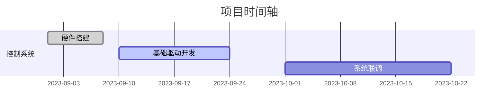

# EDC_Control 项目文档

## 项目概述

本仓库为EDC_Control项目的代码管理仓库，用于团队协作开发电子设计竞赛相关控制系统。

## 项目结构

```
EDC_Control/
├── Motor_Control/
│   ├── PID_Algorithm/       # PID控制器实现
│   │   ├── pid_core.c
│   │   └── pid_tuning.md    # 参数整定记录
│   └── Driver_Circuits/     # 驱动电路设计
├── Sensor_Module/
│   ├── Gray_Sensor/         # 灰度传感器
│   │   ├── calibration.csv  # 校准数据
│   │   └── line_follower.py 
│   └── Encoder/             # 编码器处理
├── Vision_System/
│   ├── OpenMV_Scripts/      # 机器视觉算法
│   └── Calibration_Tools/   # 摄像头校准
├── Documentation/           # 项目文档
└── Tests/                   # 测试用例
```

## 开发进度看板



## 模块说明

### Motor_Control
- **PID_Algorithm**: 实现电机PID控制算法
  - pid_core.c: PID算法核心实现
  - pid_tuning.md: PID参数整定过程记录
- **Driver_Circuits**: 电机驱动电路设计与实现

### Sensor_Module
- **Gray_Sensor**: 灰度传感器模块
  - calibration.csv: 传感器校准数据
  - line_follower.py: 循迹算法实现
- **Encoder**: 编码器信号处理模块

### Vision_System
- **OpenMV_Scripts**: 基于OpenMV的机器视觉算法
- **Calibration_Tools**: 摄像头标定工具

## 团队协作指南

### 分支管理

- **main**: 主分支，保持稳定可运行状态
- **develop**: 开发分支，功能开发完成后合并到此分支
- **feature/xxx**: 功能分支，用于开发新功能
- **bugfix/xxx**: 修复分支，用于修复bug

### 提交规范

提交信息格式：
```
<类型>(<模块>): <简短描述>

<详细描述>
```

类型包括：
- **feat**: 新功能
- **fix**: 修复bug
- **docs**: 文档更新
- **style**: 代码格式调整
- **refactor**: 代码重构
- **test**: 测试相关
- **chore**: 构建过程或辅助工具变动

示例：
```
feat(Motor_Control): 实现基础PID算法

添加了比例、积分、微分三项计算逻辑，并进行了初步参数设置。
```

### 代码审查

1. 所有代码必须通过Pull Request提交
2. 至少需要一名团队成员审查通过
3. 确保代码符合项目编码规范
4. 确保添加了必要的注释和文档

### 问题跟踪

使用GitHub Issues跟踪项目问题：
- 使用标签对问题进行分类（bug、enhancement、question等）
- 指派负责人处理问题
- 关联相关的Pull Request

## 环境配置

### 开发环境

- 编程语言：C/C++, Python
- 开发工具：VSCode, STM32CubeIDE
- 版本控制：Git

### 依赖安装

```bash
# Python依赖安装
pip install -r requirements.txt

# 其他依赖说明...
```

## 联系方式

如有任何问题，请联系项目负责人或在Issues中提出。

---

© 2025 EDC_Control Team. All Rights Reserved.
