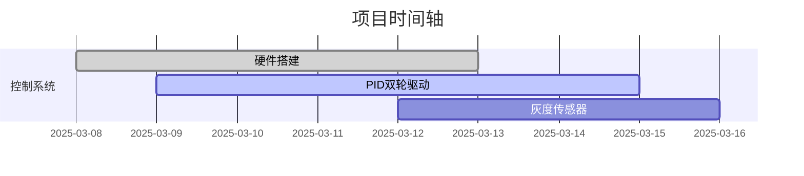

# EDC_Control 项目文档

## 🚀项目概述

本仓库为EDC_Control项目的代码管理仓库，用于团队协作开发电子设计竞赛相关控制系统。  

## 🗂 项目结构（大概）

```
EDC_Control/
├── Motor_Control/
│   ├── PID_Algorithm/       # PID控制器实现
│   │   ├── pid_core.c
│   │   └── pid_tuning.md    # 参数整定记录
│   └── Driver_Circuits/     # 驱动电路设计
├── Sensor_Module/
│   ├── Gray_Sensor/         # 灰度传感器
│   │   ├── calibration.csv  # 校准数据
│   │   └── line_follower.py 
│   └── Encoder/             # 编码器处理
├── Vision_System/
│   ├── OpenMV_Scripts/      # 机器视觉算法
│   └── Calibration_Tools/   # 摄像头校准
├── Documentation/           # 项目文档
└── Tests/                   # 测试用例
```

## 📌开发进度看板



## 📚模块说明

### Motor_Control
- **PID_Algorithm**: 实现电机PID控制算法
  - pid_core.c: PID算法核心实现
  - pid_tuning.md: PID参数整定过程记录
- **Driver_Circuits**: 电机驱动电路设计与实现

### Sensor_Module
- **Gray_Sensor**: 灰度传感器模块
  - calibration.csv: 传感器校准数据
  - line_follower.py: 循迹算法实现
- **Encoder**: 编码器信号处理模块

### Vision_System
- **OpenMV_Scripts**: 基于OpenMV的机器视觉算法
- **Calibration_Tools**: 摄像头标定工具

## 😊团队协作指南

### 分支管理

- **main**: 主分支，保持稳定可运行状态
- **develop**: 开发分支，功能开发完成后合并到此分支
- **feature/xxx**: 功能分支，用于开发新功能
- **bugfix/xxx**: 修复分支，用于修复bug

## 🔬环境配置

### 开发环境

- 编程语言：C/C++, Python
- 开发工具：VSCode, STM32CubeIDE, Keil
- 版本控制：Git

© 2025 EDC_Control Team. All Rights Reserved.
